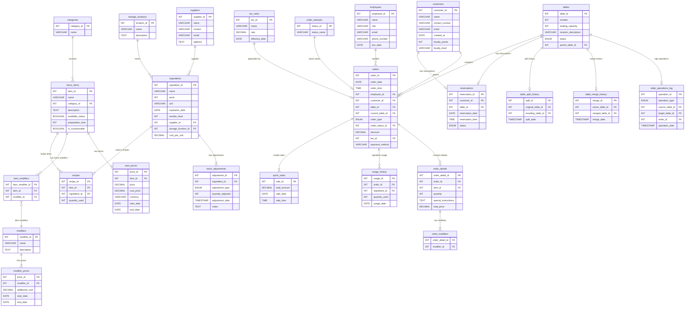

```mermaid
  erDiagram
    categories {
        INT category_id PK
        VARCHAR name
    }
    menu_items {
        INT item_id PK
        VARCHAR name
        INT category_id FK
        TEXT description
        BOOLEAN available_status
        INT preparation_time
        BOOLEAN is_customizable
    }
    order_statuses {
        INT status_id PK
        VARCHAR status_name
    }
    tax_rates {
        INT tax_id PK
        VARCHAR name
        DECIMAL rate
        DATE effective_date
    }
    storage_locations {
        INT location_id PK
        VARCHAR name
        TEXT description
    }
    suppliers {
        INT supplier_id PK
        VARCHAR name
        VARCHAR contact
        VARCHAR email
        TEXT address
    }
    ingredients {
        INT ingredient_id PK
        VARCHAR name
        INT stock
        VARCHAR unit
        DATE expiration_date
        INT reorder_level
        INT supplier_id FK
        INT storage_location_id FK
        DECIMAL cost_per_unit
    }
    item_prices {
        INT price_id PK
        INT item_id FK
        DECIMAL price
        DECIMAL cost_price
        VARCHAR currency
        DATE start_date
        DATE end_date
    }
    modifiers {
        INT modifier_id PK
        VARCHAR name
        TEXT description
    }
    modifier_prices {
        INT price_id PK
        INT modifier_id FK
        DECIMAL additional_cost
        DATE start_date
        DATE end_date
    }
    item_modifiers {
        INT item_modifier_id PK
        INT item_id FK
        INT modifier_id FK
    }
    customers {
        INT customer_id PK
        VARCHAR name
        VARCHAR contact_number
        VARCHAR email
        DATE created_at
        INT loyalty_points
        VARCHAR loyalty_level
    }
    employees {
        INT employee_id PK
        VARCHAR name
        VARCHAR role
        VARCHAR email
        VARCHAR phone_number
        DATE join_date
    }
    tables {
        INT table_id PK
        INT number
        INT seating_capacity
        VARCHAR location_description
        ENUM status
        INT parent_table_id FK
    }
    orders {
        INT order_id PK
        DATE order_date
        TIME order_time
        INT employee_id FK
        INT customer_id FK
        INT table_id FK
        INT current_table_id FK
        ENUM order_type
        INT order_status_id FK
        DECIMAL discount
        INT tax_id FK
        VARCHAR payment_method
    }
    order_details {
        INT order_detail_id PK
        INT order_id FK
        INT item_id FK
        INT quantity
        TEXT special_instructions
        DECIMAL total_price
    }
    order_modifiers {
        INT order_detail_id FK
        INT modifier_id FK
    }
    recipes {
        INT recipe_id PK
        INT item_id FK
        INT ingredient_id FK
        INT quantity_used
    }
    stock_adjustments {
        INT adjustment_id PK
        INT ingredient_id FK
        ENUM adjustment_type
        INT quantity_adjusted
        TIMESTAMP adjustment_date
        TEXT notes
    }
    usage_history {
        INT usage_id PK
        INT order_id FK
        INT ingredient_id FK
        INT quantity_used
        DATE usage_date
    }
    table_operations_log {
        INT operation_id PK
        ENUM operation_type
        INT source_table_id FK
        INT target_table_id FK
        INT order_id FK
        TIMESTAMP operation_date
    }
    table_merge_history {
        INT merge_id PK
        INT active_table_id FK
        INT merged_table_id FK
        TIMESTAMP merge_date
    }
    table_split_history {
        INT split_id PK
        INT original_table_id FK
        INT resulting_table_id FK
        TIMESTAMP split_date
    }
    reservations {
        INT reservation_id PK
        INT customer_id FK
        INT table_id FK
        DATE reservation_date
        TIME reservation_time
        ENUM status
    }
    quick_sales {
        INT sale_id PK
        DECIMAL total_amount
        DATE sale_date
        TIME sale_time
    }

    categories ||--o{ menu_items : "contains"
    menu_items ||--|{ item_prices : "has prices"
    menu_items ||--o{ item_modifiers : "can have modifiers"
    item_modifiers }o--|| modifiers : "links modifiers"
    modifiers ||--|{ modifier_prices : "has prices"
    ingredients ||--|{ stock_adjustments : "has adjustments"
    suppliers ||--o{ ingredients : "supplies"
    storage_locations ||--o{ ingredients : "stores"
    ingredients ||--|{ recipes : "used in recipes"
    orders ||--o{ order_details : "contains details"
    order_details ||--|{ order_modifiers : "has modifiers"
    tables ||--o| table_operations_log : "logs operations"
    tables ||--o| table_merge_history : "merge history"
    tables ||--o| table_split_history : "split history"
    tables ||--o| reservations : "has reservations"
    orders ||--o{ usage_history : "ingredient usage"
    employees ||--o{ orders : "handles"
    customers ||--o{ orders : "places"
    tables ||--o| orders : "assigned"
    customers ||--o| reservations : "has reservations"
    menu_items ||--o{ recipes : "recipe items"
    orders ||--|{ quick_sales : "simple sales"
    order_statuses ||--o| orders : "tracks status"
    tax_rates ||--o| orders : "applicable tax"

```